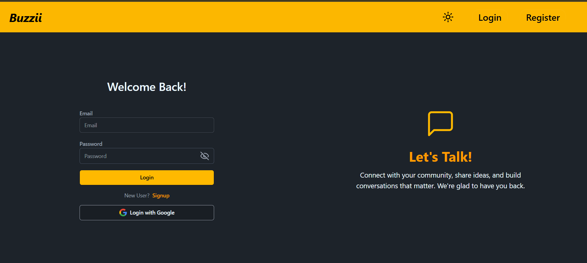
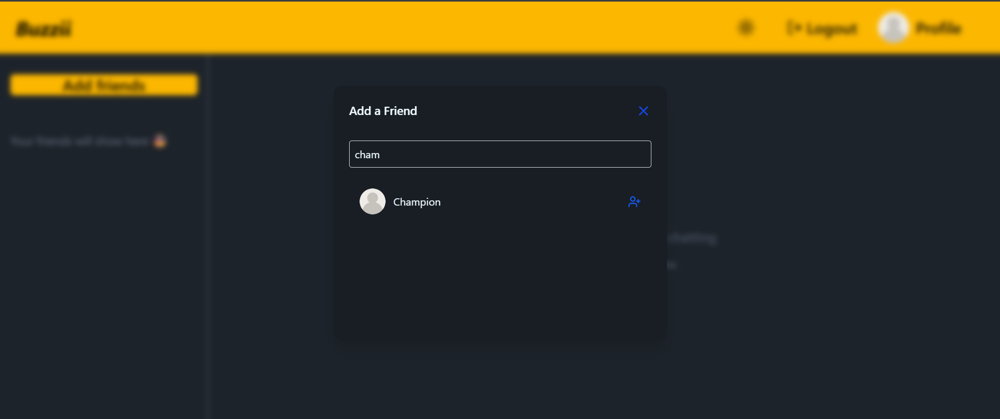
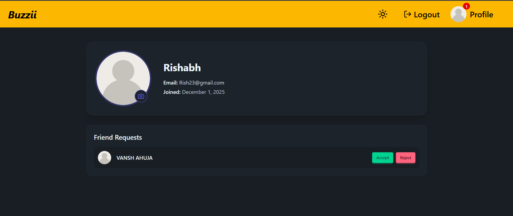
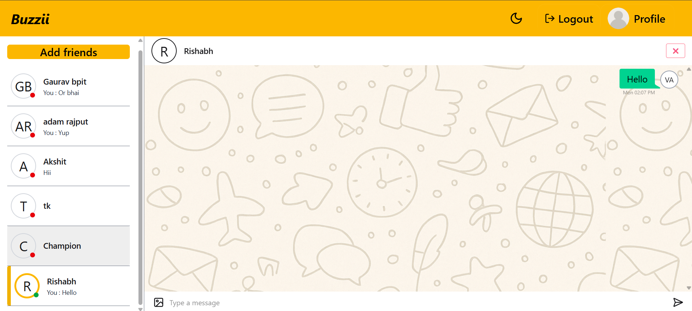

# 💬 Buzzii — Chat App

A lightweight full-stack real-time chat application with an **Express + MongoDB** backend and a **Vite + React** frontend.

## 🚀 Features
- Google OAuth login
- JWT-based authentication
- Friend requests (send / accept / reject / delete)
- Profile photo upload (Cloudinary)
- 1:1 chat system with chat history
- Real-time messaging & status via Socket.io

## 📁 Project Structure

- **Backend**: `backend/` — controllers, models, routes, and libs (`index.js`, `lib/`, `controllers/`, `models/`, `routes/`).
- **Frontend**: `frontend/` — Vite + React app (`src/`, `public/`, `vite.config.js`).

## ⚙️ Quick Setup

### Backend
Open PowerShell and run:

```powershell
cd backend
Copy-Item .env.sample .env
npm install
npm start   # or `npm run dev` if you use nodemon
```

### Frontend
Open PowerShell and run:

```powershell
cd frontend
Copy-Item .env.sample .env
npm install
npm run dev
```

### Environment variables (examples)
- `MONGO_URI`
- `JWT_SECRET`
- `GOOGLE_CLIENT_ID`
- `GOOGLE_CLIENT_SECRET`
- `GOOGLE_REDIRECT_URI`
- Cloudinary keys

## 🔌 API highlights

- Authentication & users: login, signup, Google OAuth, get user data, logout.
- Friend flows: send / accept / reject / delete requests.
- Profile photo upload and chat endpoints exist under the backend routes.

## 🖼 Screenshots







## 🚀 Deployment

- Frontend is configured for Vercel (`frontend/vercel.json`).
- For production, provide environment variables (MongoDB URI, JWT secret, OAuth and Cloudinary credentials) on the host.

